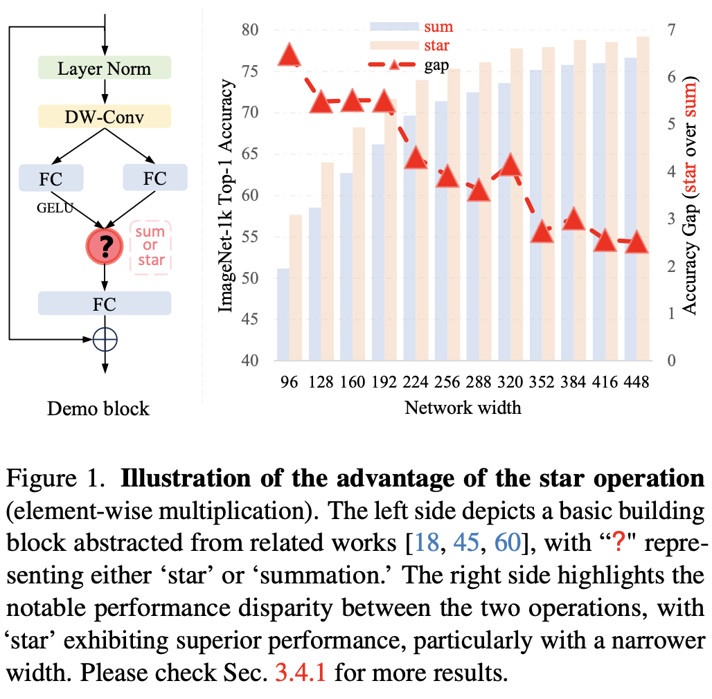

by [Xu Ma](https://ma-xu.github.io/), [Xiyang Dai](https://sites.google.com/site/xiyangdai/), 
[Yue Bai](https://yueb17.github.io/), [Yizhou Wang](https://wyzjack.github.io/), [Yun Fu](http://www1.ece.neu.edu/~yunfu/). 

Recent studies have drawn attention to the untapped potential of the **star operation** (element-wise multiplication) in network design. 
While intuitive explanations abound, the foundational rationale behind its application remains largely unexplored. 
Our study attempts to reveal the star operation’s ability of mapping inputs into high-dimensional, non-linear feature spaces — **akin to kernel tricks** — without widening the network. 
We further introduce StarNet, a simple yet powerful prototype, demonstrating impressive performance and low latency under compact network structure and efficient budget. 
Like stars in the sky, the star operation appears unremarkable but holds a vast universe of potential.

  

## Contents:

### [Folder: ImageNet Training (& Benchmark)](imagenet/)

### [Folder: Decision Boundary Visualization](2D_visual/)

## BibTeX

    @inproceedings{ma2024rewrite,
        title={Rewrite the Stars},
        author={Xu Ma and Xiyang Dai and Yue Bai and Yizhou Wang and Yun Fu},
        booktitle={Proceedings of the IEEE/CVF Conference on Computer Vision and Pattern Recognition},
        year={2024}
    }

## License
The majority of Rewrite the Stars is licensed under an [Apache License 2.0](https://github.com/ma-xu/Rewrite-the-Stars/blob/main/LICENSE)

